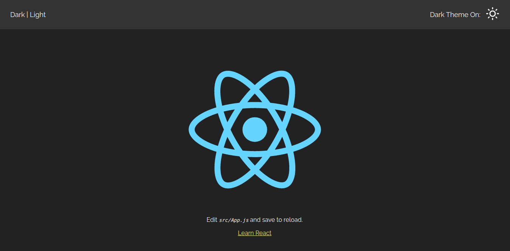
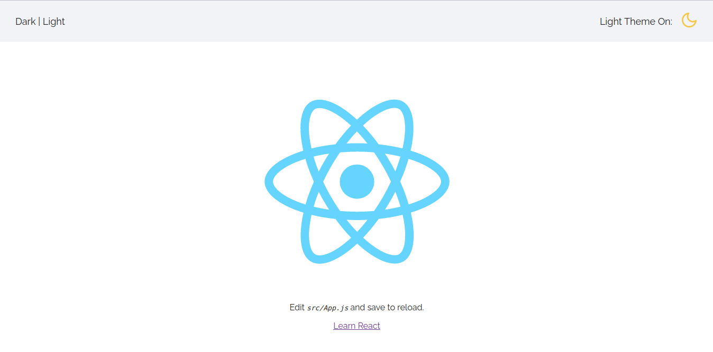

# Dark | Light

## Live Demo

The live demo version of the application can be accessed at: [lightordarkmode.netlify.app](https://darkorlightmode.netlify.app/)

## Table of Content

- [About the App](#about-the-app)
- [Technologies](#technologies)
- [Setup and Installation](#setup-and-installation)
- [Approach](#approach)
- [Screenshots](#screenshots)

## About the App

Dark | Light is a static application that simply allows a user to **toggle between dark or light mode**. Base on the user's preference, this information is stored in the user's **local storage** to prevent users from always selecting which mode they prefer when the page refreshes or when they re-visit the site.

Also, this project took advantage of React Hooks' **createContext**, **useContext** and **useReducer** to handle **global state** so that child components can access that state of the theme instead of via props.

## Technologies

- React (Hooks)
- Sass

## Setup and Installation

Follow the steps below to run the project using npm (NB: You should have **node** installed on your machine):

```
$ cd ../dark-light-mode
$ npm install
$ npm start // run in dev mode
```

## Approach

- Solution implemented using create-react-app
- Style guide adopted is **BEM**
- Global state handling using **createContext**, **useContext**, and **useReducer**

## Screenshots

